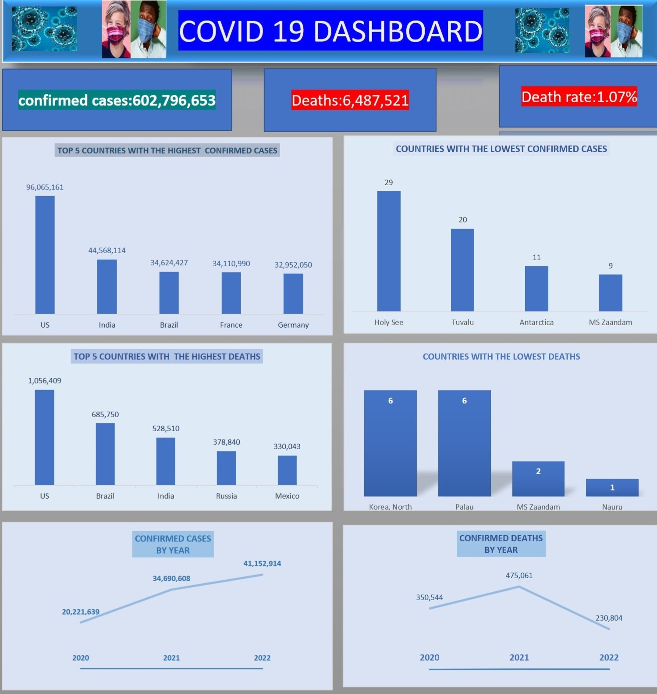
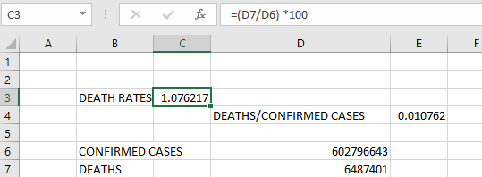

**EXPLORATORY DATA ANALYSIS ON  GLOBAL COVID-19 CASES**.

***
**Introduction**

This is my first dashboard project. My sole aim is to carry out Exploratory Data Analysis on the Global COVID-19 (2020-2022) datasets. The 3 years (2020-2022) datasets were merged to form a consolidated Table. The Extraction, data cleaning and visualizations were done using Microsoft Excel. This Project file[ (https://1drv.ms/x/s!Asgiyc23aVGR-B9lk4ziaxDRruBz) one drive or   (https://drive.google.com/drive/folders/1ZtvsUQZr3YY51eBzf0Eq9HYy7tp8LlZ3) ]comprises the daily time series data, charts and summary of the analysis with pivot tables.
Datasets (Confirmed, Death, Recovered cases and Consolidated Table).

***
 **Project Objective**
 ***
To analyze the COVID-19 victims( Top and Bottom 5 countries with the highest and lowest Confirmed, Deaths )from January 2020 to June 2022.
***
**Data Sourcing**
***

Data was scraped from the web into excel so as to have a real-time update.
Three time series tables representing the global confirmed cases, recovered cases and deaths were scraped from   CSSEGISandData/COVID19 on GitHub.
***
**Data Transformation**
***
Data preparation/cleaning was done using Power Query Editor.
- Unpivot was done on the date column
- The three time series tables were merged to form the consolidated table.
- Tables were named accordingly; Consolidated, Recovered, Death columns , Date columns were created using Text function for corresponding month, year and day. 

***
**Data Visualization**
***
Dashboard                         
:-------------------------------:
 

 Findings calculation
 :-------------------------------:

This section summarizes how Pivot table was used to carry out the following ;
- Sum of confirmed and death cases
- Sum of confirmed and cases by year 
- Top and Bottom 5 countries with sum of confirmed ,death cases
- Death rate.
- link to the project dashboard and content below;
- https://1drv.ms/x/s!Asgiyc23aVGR-B9lk4ziaxDRruBz
- 

**Extended steps carried out during Analysis**
***
 
•	Guides,steps,insights on Datasets used and Dashboard created goes thus; 
1. (i). Open a fresh/new Ms. excel worksheet so as to import the 3 Datasets used . Data ribbon>Get Data>From File>From workbook> Select multiple items ( click on Confirmed , Recovered, Death then Transform Data; so as to go to Power Query Editor) 
2. (ii) . On Power Query Editor ; The columns of the Datasets were extremely wide i.e majority of the Columns were extended as rows or there were more of columns attached as rows. Hence the need to Unpivot. 
3. (iii). Go to Home (ribbon ) > At Datatype:Text( use first row as Headers ) to promote the Header( ensure Province/state,country/Region , Lat.,Long. are the columns Headers). 
4. 	(iv) Since all the other columns to be "UNPIVOT" are all at the R.H.S(after Province/state,Country/region,Lat.,Long.) click on the First four(4) column then right click on "unpivot other columns" 
5. (v). Rename the Last two(2) columns ( " Attributes " & "Value") as "date" & "Confirmed" respectively.
6. (vi). On the L.H.S Click on Recovered Table and carry out steps (ii)-(v) and ensure that the Province/state ,country/Region,Lat.,Long., are promoted to Headers then rename the newly created "Attributes" & "Values" columns as "date" & "Recovered" respectively. 
7. (vii). on the L.H.S , click on the Death Table and carry out steps (ii)-(v) and rename the newly created "Attributes" & "Value" as "date" & "Death" respectively. 
•	Merge the 3 tables on the L.H.S( Confirmed,Recovered, Death together as I.e Consolidate the Data) Since it's impossible to merge 3 tables together at once,merge the First two(2) Tables(confirmed & Recovered) then merge the lastly merged table with the last table(Death) to create a Consolidated Data. while on the Confirmed table go to Home>Merge Queries(merge queries as New) then Select the other table (Recovered); press Ctrl to select& merge columns( province/state, country/Region, date ) Since the Lat.,Long. are the same then ok. On the L.H.S "Merge 1" Table is created while on the R.H.S , newly created column named "Recovered" was created.. At the "Recovered" column on the R.H.S ( Click the direction icon to unselect "All columns", check "Recovered", uncheck the "original column name as prefix" then ok. Hence newly "Recovered.1" column is created then rename it to "Recovered" Merge the "Merge.1" Table on the L.H.S with the Death Table using the same procedure above then rename the "Death.1" created column as "Death" . Rename the "Merge.1" Table as "ConsolidatedData" Use the Text column Function on date column so as to split the date and create separate columns for day, month,year respectively 
8. Use Pivot Table to generate every feature on the Dashboard.
9. You can be creative by applying all the steps above to create a different Dashboard insight or design using the Dataset located on this repository files.
10. Remember to check the complete/ absolute detailed Project File for better real time interaction after downloading via the link on the **Introduction** tab/section above.
11. cc:Kindly reach out to me via the contacts on my github profile page provided perhaps you need to get more clarification regarding the project

